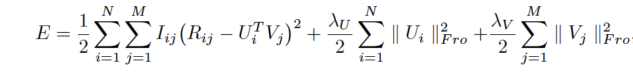
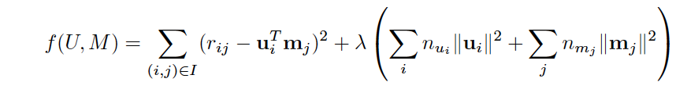
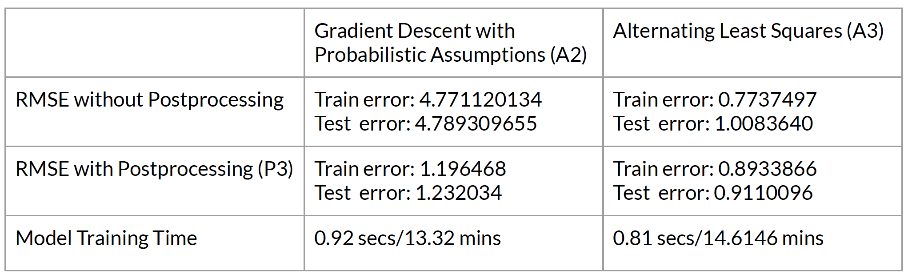

# **1. Introduction**

Recommendation system plays a vital role in e-commerce and online streaming services such as Amazon, Netflix, and Youtube. The primary goal of recommendation systems is to help users find what they want based on their preferences. 

In this project, the datasets that we are going to use describe 5-star ratings from a movie recommendation service. We implemented two methods for collaborative filtering from scratch, namely Gradient Descent with Probabilistic Assumptions (A2) and Alternating Least Squares (A3). Then we have used SVD with Kernel Ridge Regression (P3) for post-processing to improve prediction accuracy. Later on, we compared and summarized the performance of these two methods given the same post-processing method. 

# **2. Data Processing and Train-test Split**

```{r setup, include=FALSE}
knitr::opts_chunk$set(echo = TRUE)
```

```{r, include=FALSE}
options(tinytex.verbose = TRUE)
```

```{r, message=FALSE, echo=FALSE}
if(!require("remotes")){
  install.packages("remotes")
}
if(!require("krr")){
  remotes::install_github("TimothyKBook/krr")
}
if(!require("dplyr")){
  install.packages("dplyr")
}
if(!require("caret")){
  install.packages("caret")
}
if(!require("pracma")){
  install.packages("pracma")
}
if(!require("ggplot2")){
  install.packages("ggplot2")
}
if(!require("tidyverse")){
  install.packages("tidyverse")
}
if(!require("gridExtra")){
  install.packages("gridExtra")
}
library(krr)
library(dplyr)
library(caret)
library(tidyr)
library(ggplot2)
library(tidyverse)
library(pracma)
library(gridExtra)
data <- read.csv("../data/ml-latest-small/ratings.csv")
```

```{r}
set.seed(0)
# shuffle the row of the entire dataset
data <- data[sample(nrow(data)),]
# get a small dataset that contains all users and all movies
unique.user<-duplicated(data[,1])
unique.movie<-duplicated(data[,2])
index<-unique.user & unique.movie
all.user.movie <- data[!index,]
# split training and test on the rest
rest <- data[index,]
test_idx <- sample(rownames(rest), round(nrow(data)/5, 0))
train_idx <- setdiff(rownames(rest), test_idx)
# combine the training with the previous dataset,
# which has all users and all movies
data_train <- rbind(all.user.movie, data[train_idx,]) 
data_test <- data[test_idx,]
# sort the training and testing data by userId then by movieId, 
# so when we update p and q, it is less likely to make mistakes 
data_train <- arrange(data_train, userId, movieId)
data_test <- arrange(data_test, userId, movieId)
```

# **2. Algorithm Implementation**

## **2.1 Gradient Descent with Probabilistic Assumptions (A2)**

The idea behind this method refers to Probabilistic Matrix Facterization (PMF). Suppose there are $M$ movies and $N$ users, and integer rating values from 1 to $K$. Let $R_{ij}$ represent the rating of user $i$ for movie $j,U ∈ R^{D*N}$ and $V ∈ R^{D*M}$ be a latent user and movie feature matrices. We try to minimise the following objective function:



**Method implementation**

```{r}
#Load ratings 
ratings <- read.csv("../data/ml-latest-small/ratings.csv")
user_count <- length(unique(ratings$userId))
movie_count <- length(unique(ratings$movieId))
```

Factor variable for different output: (100 is currently displayed but, {10,50,100} were applied, as seen in below output) 

```{r}
#Factor to use 
a2_factor <- 100
```

```{r}
#Create Matrices 
load("../output/data_train.csv")

sig  <- .01
sig_p <- 1
sig_q <- 1

total_num <- user_count*movie_count

R <- matrix(rep(0,total_num), nrow=user_count,ncol=movie_count)
P <- matrix(rnorm(mean=0,sd=sig_p,user_count*a2_factor),nrow=user_count,ncol=a2_factor)
Q <- matrix(rnorm(mean=0,sd=sig_q,movie_count*a2_factor),nrow=movie_count,ncol=a2_factor)

cnames <-  as.character(unique(ratings$movieId))
rnames <- as.character(unique(ratings$userId))
colnames(R) <- cnames
rownames(R) <- rnames

for(user in 1:2){
  user_ratings <- data_train[user,2:3]
  rated <- user_ratings$movieId
  R[user,rated] <- user_ratings$rating
} 

```

```{r}
#A2 functions for PMF algorithm
MSE <- function(R,P,Q){
  PQT <- P %*% t(Q)
  err = R - PQT
  I <- ifelse(R!=0,0.5,0)
  sq_err <-  err^2
  ans = I*sq_err
  mse <- sum(ans)
  return(mse)
}

L2 <- function(s1,s2,X){
  sq_X <- X^2
  sum <- sum(sq_X)
  c <- s1 / (s2*2)
  c_sum <- c*sum
  return(c_sum)
}

d_pq <- function(R,P,Q,s,sp,sq){
  PQT <- P %*% t(Q)
  err = R - PQT 
  I <- ifelse(R!=0,1,0)
  res <- I*err
  d_p <- -1.0 * res %*% Q + s/sp *  P
  d_q <- -1.0 * t(res) %*% P + s/sq * Q
  return(list(d_p,d_q))
}

```

```{r}
#Run A2 algorithm
learn_rate1 <- 0.001
learn_rate2 <- 0.0001

error <-  MSE(R,P,Q) + L2(sig,sig_p,P) + L2(sig,sig_q,Q)

while(error >= 230){
  if(error > 300){
    lr <- learn_rate1
  }
  else{
    lr <- learn_rate2
  }
  D <- d_pq(R,P,Q,sig,sig_p,sig_q)
  d_p <- D[[1]]
  d_q <- D[[2]]
  P <- P - lr * d_p
  Q <- Q - lr * d_q
  error <- MSE(R,P,Q)
}
```

```{r}
#create R matrix prediction 
R <- P %*% t(Q)

#MSE
find_mse <- function(data,test){
  movies<-data$movieId
  users<-data$userId
  pred<-as.numeric(t(test[match(c(as.character(users)),rownames(test)),match(c(as.character(movies)),colnames(test))]))
  return(mean((data$rating-pred)^2))
}
```

**Evaluation**

Train error given factor level:

```{r}
#Train RMSE 
m1 <- find_mse(data_train[1:10000,],R)
m2 <- find_mse(data_train[10001:20000,],R)
m3 <- find_mse(data_train[20001:30000,],R)
m4 <- find_mse(data_train[30001:40000,],R)
m5 <- find_mse(data_train[40001:50000,],R)
m6 <- find_mse(data_train[50001:60000,],R)
m7 <- find_mse(data_train[60001:70000,],R)
m8 <- find_mse(data_train[70001:80000,],R)
m9 <- find_mse(data_train[80001:dim(data_train)[1],],R)
train_rmse <- sqrt(((m1+m2+m3+m4+m5+m6+m7+m8)*10000+(dim(data_train)[1]-80000)*m9)/dim(data_train)[1])
train_rmse
```

Test error given factor level: 

```{r}
load("../output/data_test.csv")
#Test RMSE
mean11<-find_mse(data_test[1:10000,], R)
mean21<-find_mse(data_test[10001:20000,],R)
mean32<-find_mse(data_test[20001:dim(data_test)[1],],R)
test_rmse<-sqrt(((mean11+mean21)*10000+(dim(data_test)[1]-20000)*mean32)/dim(data_test)[1])
test_rmse
```

Saving the error output for each factor level:

```{r}
#save rmse 
#first save factor rmse 
#a2_rmse <- data.frame(factor=c(a2_factor,a2_factor),Type=c("Train.RMSE","Test.RMSE"),RMSE=c(train_rmse,test_rmse))
#write.csv(a2_rmse,file="../output/a2_rmse.csv",row.names = F)
#
#a2_rmse <-read.csv("../output/a2_rmse.csv")
#current <- data.frame(factor=c(a2_factor,a2_factor),Type=c("Train.RMSE","Test.RMSE"),RMSE=c(train_rmse,test_rmse))
#a2_rmse <- rbind(a2_rmse,current)
#write.csv(a2_rmse,file="../output/a2_rmse.csv",row.names = F)
```

**Visualization**

```{r}
#plot A2 rmse 
library(ggplot2)

a2_rmse <-read.csv("../output/a2_rmse.csv")
p.A2P3 <-ggplot(a2_rmse, aes(x=factor, y=RMSE, col=Type))+
  geom_line()+
  labs(title = "Gradient Descent", x="Number of Factors", y="RMSE")+
  theme_light()+
  theme(plot.title = element_text(hjust = 0.5))
p.A2P3
a2_rmse
```

As illustrated above, we can see that the MSE for Test and Training data decreases as the number of factors decreases, indicating that lower factor levels produce a better model when only utilizing gradient descent. 

## **2.2 Alternating Lease Squares (A3)**

In our project, we implement alternating least squares (ALS) menthod to solve the low-rank matrix factorization problem. In general, We are trying to minimise the following objective function with respect to U, M:




**The alternating least squares (ALS) method is defined as follows:**

+ **Step 1:** Initial movie matrix M by assigning the average rating for that movie as the first row, and small random numbers for the remaining entries
+ **Step 2:** Fix M, solve U by minimizing the objective for the remaining entries
+ **Step 3:** Fix U, solve M by minimizing the objective function similarly
+ **Step 4:** Repeat Steps 2 and 3 until a stopping criterion is satisfied

**The full code:**

```{r}

ALS <- function(factors = 10, lambda = 1, max.iter=20, data, 
                train=data_train, test=data_test){
  U <- length(unique(data$userId))
  M <- length(unique(data$movieId))
  
  train_RMSE <- c()
  test_RMSE <- c()
  
  
  # define the Movie matrix and introduce the penalty term

  Movie <- matrix(runif(factors*M, -1, 1), ncol = M)
  colnames(Movie) <- levels(as.factor(data$movieId))
  
  movie.average <- data %>%
    group_by(movieId) %>% 
    summarize(ave=mean(rating))
  
  Movie_id<- names(table(data$movieId))
  movie.id <- sort(unique(data$movieId))
  
  Movie[1,] <- movie.average$ave
  
  
  # define the user matrix and introduce the penalty term
  
  User <- matrix(runif(factors*U, -1, 1), ncol = U) 
  colnames(User) <- levels(as.factor(data$userId))
  
  v1 <- aggregate(data,list(data$userId),length)
  each_m <- as.numeric(unname(table(data$movieId)))
  v2 <- cbind(Movie_id,each_m)
  

  # mutate trainset again
  
  train <- arrange(train, userId, movieId)
  
  # make the iteration 
  
  for (i in 1:max.iter){
    
    # Fix M, Solve U
    
    for (u in 1:U) {
      v1_1<- as.numeric(v1[u,2])
      
      x<-train[train$userId==u,]$rating
      
      v1_2 <- matrix(x,nrow=length(x),ncol=1)
      
      User[,u] <- solve(Movie[,as.character(train[train$userId==u,]$movieId)] %*%
                          t(Movie[,as.character(train[train$userId==u,]$movieId)]) + 
                          lambda * v1_1 * diag(factors)) %*%
        Movie[,as.character(train[train$userId==u,]$movieId)] %*% v1_2
      }
    
    
    # Fix U, Solve M  
    
    for (m in 1:M) {
      v2_1 <- as.numeric(v2[m,2])
      
      y<-train[train$movieId==movie.id[m],]$rating
      
      v2_2 <- matrix(y,nrow=length(y),ncol=1)
      
      Movie[,m] <- solve (User[,train[train$movieId==movie.id[m],]$userId] %*% 
                            t(User[,train[train$movieId==movie.id[m],]$userId]) + 
                            lambda * v2_1  * diag(factors)) %*%
        User[,train[train$movieId==movie.id[m],]$userId] %*% v2_2
      }
    
     # define RMSE function
    
     RMSE <- function(rating, rating_estimate){
       sqr_err <- function(obs){
         sqr_error <- (obs[3] - rating_estimate[as.character(obs[1]), 
                                      as.character(obs[2])])^2
         return(sqr_error)
         }
       return(sqrt(mean(apply(rating, 1, sqr_err))))
       }

     
     # computing rating_estimate and make the colnames
    
    rating_estimate <- t(User) %*% Movie 
    colnames(rating_estimate) <- levels(as.factor(data$movieId))
    
    
    # print the result
    
    cat("iter:", i, "\t")
  
    train_RMSE_1 <- RMSE(rating=train, rating_estimate=rating_estimate )
    cat("training RMSE:", train_RMSE_1, "\t")
    train_RMSE <- c(train_RMSE, train_RMSE_1)
    
    test_RMSE_1<- RMSE(rating=test,rating_estimate=rating_estimate )
    cat("test RMSE:",test_RMSE_1, "\n")
    test_RMSE <- c(test_RMSE, test_RMSE_1)
    
  }
  ratings<-t(as.matrix(User))%*%as.matrix(Movie)
  return(list(p = User, q = Movie, r= ratings,
              train_RMSE = train_RMSE,
              test_RMSE = test_RMSE))
  
}
```


Then we want to get the r and q matrix for different latent factors and lambda. Here is an example code of geting the r and q matrix for factor of 10, lambda of 5 and RMSE:

```{r}
# the r and q matrix for factor of 10, lambda of 5 and RMSE
als1= ALS(f = 10, lambda = 5, max.iter=5, data, train=data_train, test=data_test)
movie_10= als1$q
rating_10=t(as.matrix(als1$p))%*%as.matrix(als1$q)
# write.csv(movie_10, file = "../output/A3_movie_factor10.csv")
# write.csv(rating_10, file = "../output/A3_rating_factor10.csv")
```

Using similar method, we tried with other combinations and saved results in our output folder.

```{r}
# # the r matrix and q matrix for factor of 50, lambda of 5 and RMSE
# als2= ALS(f = 50, lambda = 5, max.iter=5, data, train=data_train, test=data_test)
# #the r matrix and q matrix for factor of 100, lambda of 5 and RMSE
# als3= ALS(f = 100, lambda = 5, max.iter=5, data, train=data_train, test=data_test)
# # the r matrix and q matrix for factor of 100, lambda of 1 and RMSE
# als4= ALS(f = 100, lambda = 1, max.iter=5, data, train=data_train, test=data_test)
# # the r matrix and q matrix for factor of 100, lambda of 0.1 and RMSE
# als5= ALS(f = 100, lambda = 0.1, max.iter=5, data, train=data_train, test=data_test)
# # the r matrix and q matrix for factor of 100, lambda of 0.5 and RMSE
# als6= ALS(f = 100, lambda = 0.5, max.iter=5, data, train=data_train, test=data_test)
```

**Model Evaluation**

```{r}
als=data.frame(Factors=c(100,100,100),Lambda =rep(c(0.1,1,5),2),
               RMSE=c(0.7737497,1.477465,3.646715, 1.008364,1.582375,3.680143),
               Variable=c(rep("training",3),rep("test",3)))
als
```

**Model Evaluation Visualisation**

```{r}
p1 <- ggplot(als, aes(x = Lambda, y = RMSE, colour=Variable)) + 
  geom_line() +
  ggtitle("Alternating Least Squares") +
  theme(legend.position = "none") +
  ylim(0.07, 3.7) +
  ylab("RMSE") +
  scale_x_continuous("Number of factors", breaks=c(0.1, 1,5))+
  scale_colour_discrete(name = "Variables", labels = c("Train RMSE", "Test RMSE"))+
  theme_light()
p1
```

After having tried multiple different parameter combinations, we chose factors as 100, lambda as 0.5 for our ALS final model.

**Experimental Results for ALS:**

```{r}
ALS_result <- ALS(factors = 100, lambda =0.5,
              max.iter = 5, data = data,
              train = data_train, test = data_test)
save(ALS_result, file = "../output/ALS_result.Rdata")
```

As illustrated above, we can tell that the MSE for Test data and Training data decreases in overall. The RMSE of training data is much more steep. The overall decrease of the RMSE does show good result for ALS. 

# **3. Post-processing SVD with Kernel Ridge Regression**

In the regularized SVD predictions for user $i$ and movie $j$ are made in the following way: 


where $u_i$ and $v_j$ are K-dimensional vectors of parameters. Parameters are estimated by minimizing the sum of squared residuals.


The idea of improving SVD is to discard all weights $u_{ik}$ after training and try to predict $y_{i,j}$ for each user $i$ using $v_{jk}$ as predictors, i.e ridge regression. Let's redefine $y$ as as a vector and $X$ be a matrix of observations - each row of $X$ is normalized vector of features of one movie $j$ rated by user $i$ : $x_{j2}$ = $v_j$/$||v_j||$. Then we can predict $y$ using ridge regression:


By changing Gram matrix to a chosen positive definite matrix $K(X,X)$, we can obtain the method of kernel ridge ridge regression. Predictions in this model are made in the following way:


where the good results can be obtained with Gaussian kernel $K(x^T_i,x^T_j) = exp(2(x^T_i*x_j-1))$.

## **3.1 Gradient Descent with Probabilistic Assumptions (A2) with Post-processing**

**Model implementation**

Postprocessing SVD with kernel ridge regression is conducted on Gradient Descent with Probabilistic Assumptions (currently with the above stipulated 100 factor level). The saved output of the utilized in the assessment of the model is with factors {10,50,100}.

```{r}
load("../output/data_test.csv")
load("../output/data_train.csv")
r <- R
q <- t(Q)
movie <- unique(data_train$movieId)
```

```{r}
sp_train <- split(data_train,data_train$userId)
q_sp <- list()
for (k in 1:length(sp_train)){
  temp <- c()
for (i in 1:dim(sp_train[[k]])[1]){
 temp<-cbind(temp,q[,which(movie==sp_train[[k]]$movieId[i])])}
 q_sp [[k]]<-temp
}

nor <- function(x){
  return(x/sqrt(sum(x^2)))
}

q_trans <- t(apply(q,2,nor))
val_sp <- list()
for (k in 1:length(sp_train)){
  val_sp[[k]]<-apply(q_sp [[k]],2,nor)}
dat_sp <- list()
for (k in 1:length(sp_train)){
  dat_sp[[k]]<-cbind(sp_train[[k]]$rating,t(val_sp[[k]]))}

#Tune lambda with CV
krr.cv <- function(data, kfold, p){
  
  set.seed(0)
  data.x <- as.matrix(data[,-1])
  data.y <- data[,1]
  n <- nrow(data.x)
  cv.id <- createFolds(1:n, k = kfold)
  cv.tuning <- c()
  for (j in cv.id){
    train.x <- data.x[-j,]
    train.y <- data.y[-j]
    cv.x <- data.x[j,]
    cv.y <- data.y[j]
    
    mod.cv <- krr(x = train.x,  train.y, lambda = p)

    pred.cv <- predict(mod.cv, cv.x)

    rmse.cv <- sqrt(mean((cv.y - pred.cv)^2))
    cv.tuning <- cbind(cv.tuning, rmse.cv)
    cv.mean <- mean(cv.tuning)
    }
  return(cv.mean)
}
#try lambda values
lambda <- c(0.45, 0.50, 0.55)
rmse_tune <- data.frame(lambdas=lambda,rmse=rep(0,length(lambda)))
for (i in 1:length(lambda)){
  m <- lapply(dat_sp, krr.cv, 5, lambda[i])
  rmse_tune[i,2] <-  sum(unlist(m))
}
best_lambda <- rmse_tune %>%
  filter(rmse == min(rmse))
best_lambda <- best_lambda$lambda

train_model <- vector(mode="list",length=length(dat_sp))
for(i in 1:length(dat_sp)){
  train_model[[i]]<-krr(dat_sp[[i]][,-1],dat_sp[[i]][,1], best_lambda)}

rating_preds <- matrix(NA,nrow=length(dat_sp),ncol=dim(q)[2])
for (i in 1:length(dat_sp)){
  rating_preds [i,]<-predict(train_model[[i]],q_trans)}

rating <- r
colnames(rating) <- c(as.character(movie))
rownames(rating)<-c(1:610)
colnames(rating_preds )<-c(as.character(movie))
rownames(rating_preds )<-c(1:610)
```


**Evaluation**

Finding the optimal weight and RMSE

```{r}
#Find weight 
weights <- seq(0,1,0.1)
train_rmse <- data.frame(weights=weights,rmse=rep(0,length(weights)))
wr <- list()
for (i in 1:length(weights)){
  wr[[i]]<- rating*(1-weights[i]) + rating_preds *weights[i]
  wr[[i]]<-as.matrix(wr[[i]])
  m1 <- find_mse(data_train[1:10000,],wr[[i]])
  m2 <- find_mse(data_train[10001:20000,],wr[[i]])
  m3 <- find_mse(data_train[20001:30000,],wr[[i]])
  m4 <- find_mse(data_train[30001:40000,],wr[[i]])
  m5 <- find_mse(data_train[40001:50000,],wr[[i]])
  m6 <- find_mse(data_train[50001:60000,],wr[[i]])
  m7 <- find_mse(data_train[60001:70000,],wr[[i]])
  m8 <- find_mse(data_train[70001:80000,],wr[[i]])
  m9 <- find_mse(data_train[80001:dim(data_train)[1],],wr[[i]])
  train_rmse[i,2]<-sqrt(((m1+m2+m3+m4+m5+m6+m7+m8)*10000+(dim(data_train)[1]-80000)*m9)/dim(data_train)[1])
}
weight <- match(min(train_rmse$rmse), train_rmse$rmse)
train_rmse
#minTrain RMSE
train_rmse <- min(train_rmse$rmse)
```

By finding the optimal weight for each factor we are able to minimize the RMSE. 

```{r}
#Test RMSE
mean11<-find_mse(data_test[1:10000,], wr[[weight]])
mean21<-find_mse(data_test[10001:20000,],wr[[weight]])
mean32<-find_mse(data_test[20001:dim(data_test)[1],],wr[[weight]])
test_rmse<-sqrt(((mean11+mean21)*10000+(dim(data_test)[1]-20000)*mean32)/dim(data_test)[1])
test_rmse
```

```{r}
#save rmse 
#first save factor rmse 
#a2_rmse <- data.frame(FACTOR=a2_factor,TRAIN=rmse_train,TEST=rmse_test)
#save(a2_rmse,file="../output/a2_rmse.RData")
#
#load and save rmse
#load("../output/a2p3_rmse.RData")
#current <- data.frame(FACTOR=a2_factor,TRAIN=train_rmse,TEST=test_rmse)
#a2_rmse <- rbind(current,a2_rmse)
#save(a2_rmse,file="../output/a2p3_rmse.RData")
```

```{r}
#plot A2P3 rmse 
library(ggplot2)

A2.P3 <-read.csv("../output/A2P3.csv")

p.A2P3<-ggplot(A2.P3, aes(x=factor, y=RMSE, col=Type))+
  geom_line()+
  labs(title = "Gradient Descent with Post-processing", x="Number of Factors", y="RMSE")+
  theme_light()+
  theme(plot.title = element_text(hjust = 0.5))
p.A2P3
```

With the above plot we can see an increased accuracy of the model as the factor size becomes larger. 

## **3.2 Alternating Least Squares (A3) with Post-processing**

**Model implementation**

In this report, postprocessing SVD with kernel ridge regression is conducted on ALS with 50 factors as an example. ALS with 10 factors and 100 factors follow the same procedure. *q matrix* calculated from A3 algorithm is used here to get the prediction with P3 postprocessing method. *r matrix*, which includes predicted rating will be used later and it will be explained in later part. 

### **a) Prepare data for Postprocessing**

First, load necessary datasets. 

```{r}
n<-nrow(data)
set.seed(0)
train_idx<-sample(n, round(n*0.8))
traindata<-data[train_idx,]
testdata<-data[-train_idx,]

####change these values to obtain results of different factor number####
factor100<-FALSE
factor50<-TRUE
factor10<-FALSE
##################################################

if(factor100 == TRUE){
  q<-read.csv("../output/A3_movie_lambda0.5.csv", header = FALSE)
  load("../output/A3_rating_lambda0.5.RData")
}else{
  if(factor50 == TRUE){
    q<-read.csv("../output/A3_movie_factor50.csv", header = FALSE)
    load("../output/A3_rating_factor50.RData")
  }else{
    q<-read.csv("../output/A3_movie_factor10.csv", header = FALSE)
    load("../output/A3_rating_factor10.RData")
  }
}
```

Then, to transform data into formats that can be applied in *krr()* function. First, split the training dataset by userId. The first row of *q matrix* generated by ALS represents movie id. Then, create a new *q* list and each element represents information of movies rated by corresponding user and normallize this list. This new *q* list is for training model. Finally, create a data frame with true ratings being Y and the normalized list as X. 

```{r}
train.split<-split(traindata, traindata$userId)
movie<-as.vector(unlist(c(q[1,])))
q<-as.matrix(q[-1,])
trainq.split<-list()
for (k in 1:length(train.split)){
  new<-c()
  for (i in 1:dim(train.split[[k]])[1]){
 new<-cbind(new,q[,which(movie==train.split[[k]]$movieId[i])])
 }
  trainq.split[[k]]<-new
 }
normal<-function(vec){
  return(vec/sqrt(sum(vec^2)))
}
q.trans<-apply(q,2,normal)
q.trans[which(is.na(q.trans))]<-0
data.split<-list()
for(i in 1:length(trainq.split)){
  normq.split<-apply(trainq.split[[i]], 2, normal)
  data.split[[i]]<-cbind(train.split[[i]]$rating, t(normq.split))
}
```

### **b)Tuning Parameter**

Tune the parameter $\lambda$ in *krr()* to minimizing RMSE by cross validation. In this report, 5 folds created for cross validation. 

```{r CV FUNCTION}
CV.KRR<-function(data, K, lambda){
  n<-nrow(data)
  Xdata<-data[,-1]
  Ydata<-data[,1]
  set.seed(0)
  folds <- createFolds(1:n, K)  
  cv.error<-c()
  
  for (i in folds){
    Xtrain<-Xdata[-i, ]
    Ytrain<-Ydata[-i]
    Xvali<-Xdata[i, ]
    Yvali<-Ydata[i]
    
    model<-krr(x=Xtrain, y=Ytrain, lambda = lambda)
    pred<-predict(model, Xvali)
    
    error<-sqrt(mean((Yvali-pred)^2))
    cv.error<-c(cv.error, error)
  }
  return(mean(cv.error))
}
```

Although the paper suggested the optimal $\lambda$ is 0.5, we found that 0.75 is better in this case. For factor=10 and factor=100, the best choice of $\lambda$ is also 0.75. 

```{r tune lambda}
lambdas<-c(0.75, 0.8, 0.85)
rmse.para<-data.frame(lambda=lambdas, rmse=rep(0, length(lambdas)))
for (i in 1:length(lambdas)){
  error<-lapply(data.split, CV.KRR, 5, lambdas[i])
  rmse.para[i, 2]<-mean(unlist(error))
}  
lambda.best<-rmse.para$lambda[which.min(rmse.para$rmse)]
```

### **c)Train model and get prediction**

Using $\lambda=0.75$ to train krr model for each user and get rating prediction for all movies of each use. In other words, the size of prediction matrix should be 610(uses)*9725(moviess).

```{r}
pred<-matrix(0, length(data.split), ncol(q))
for (i in 1:length(data.split)){
  model<-krr(data.split[[i]][,-1], data.split[[i]][,1], lambda.best)
  pred[i, ]<-predict(model, t(q.trans))
}
```

**Evaluation**

*r matrix* generated by ALS contains rating prediction without postprocessing. Combine the predictions of methods with and without postprocessing. Explore what weight of postprocessing gave the best performance. 

*mse()* function for calculating MSE. Find predicted ratings in prediction matrix by matching userId and movieId from original dataset. 

```{r mse}
mse<-function(ori, calc){
  movie<-ori$movieId
  user<-ori$userId
  pred<-diag(as.matrix(calc[match(as.character(user), rownames(calc)), match(as.character(movie), colnames(calc))]))
  return(mean((ori$rating-pred)^2))
}
```

Rename *r matrix* and rating prediction matrix to keep names consistent. 

```{r}
r<-r[-1,]
colnames(r)<-as.character(movie)
rownames(r)<-c(1:610)
colnames(pred)<-as.character(movie)
rownames(pred)<-c(1:610)
```

Find the best weight. 

```{r}
weight<-seq(0, 1, 0.1)
rmse.train<-data.frame(weight=weight, RMSE=rep(0, length(weight)))
for (i in 1:length(weight)){
  rating.weight<-r*(1-weight[i])+pred*weight[i]
  rating.weight<-as.matrix(rating.weight)
 
   ###reached the limit of computer memory
  
  meanA<-mse(traindata[1:30000, ], rating.weight)
  meanB<-mse(traindata[30001:60000, ], rating.weight)
  meanC<-mse(traindata[60001:nrow(traindata), ], rating.weight)
  rmse.train[i, 2]<-sqrt(((meanA+meanB)*30000+meanC*(nrow(traindata)-60000))/nrow(traindata))
}
rmse.train
```
 
We can see that weight=0.7 minimized the RMSE in this case. Same for cases of other number of factors. 

Use the best weight and we can find the RMSE here is reduced substaintially.

```{r}
weight.best<-rmse.train$weight[which.min(rmse.train$RMSE)]
rw.best<-r*(1-weight.best)+pred*weight.best
meanT<-mse(testdata, rw.best)
rmse.test<-sqrt(meanT)
rmse.test
```

By changing the value of *factor100*, *factor50*, *factor10* at the begining of this section, we can obtain corresponding RMSE. We load results from output to draw this RMSE plot. 

```{r}
P3.A3<-read.csv("../output/A3P3.csv")
p.A3P3<-ggplot(P3.A3, aes(x=factor, y=RMSE, col=Type))+
  geom_line()+
  labs(title = "ALS with Postprocessing", x="Number of Factors", y="RMSE")+
  theme_light()+
  theme(plot.title = element_text(hjust = 0.5))
p.A3P3
```

# **4. Conclusion**

```{r}
A2.P3 <-read.csv("../output/A2P3.csv")
p.A2P3<-ggplot(A2.P3, aes(x=factor, y=RMSE, col=Type))+
  geom_line()+
  labs(title = "Prob GD with Postprocessing", x="Number of Factors", y="RMSE")+
  theme(legend.position="bottom",legend.box="vertical")+
  theme(plot.title = element_text(hjust = 0.5))

P3.A3<-read.csv("../output/A3P3.csv")
p.A3P3<-ggplot(P3.A3, aes(x=factor, y=RMSE, col=Type))+
  geom_line()+
  labs(title = "ALS with Postprocessing", x="Number of Factors", y="RMSE")+
  theme(legend.position="bottom",legend.box="vertical")+
  theme(plot.title = element_text(hjust = 0.5))

grid.arrange(p.A2P3,p.A3P3,nrow=1)
```



From the above table, if we implement A2 and A3 methods without post-processing, the resulting RMSE of alternating least squares method is lower than gradient descent probabilistic assumptions. The running time for both methods almost the same. After performing the post-processing procedure, we can see that there is an improvement in model prediction accuracy for both methods. Besides,the alternating least squares model outperformes gradient descent with probabilistic assumptions.


